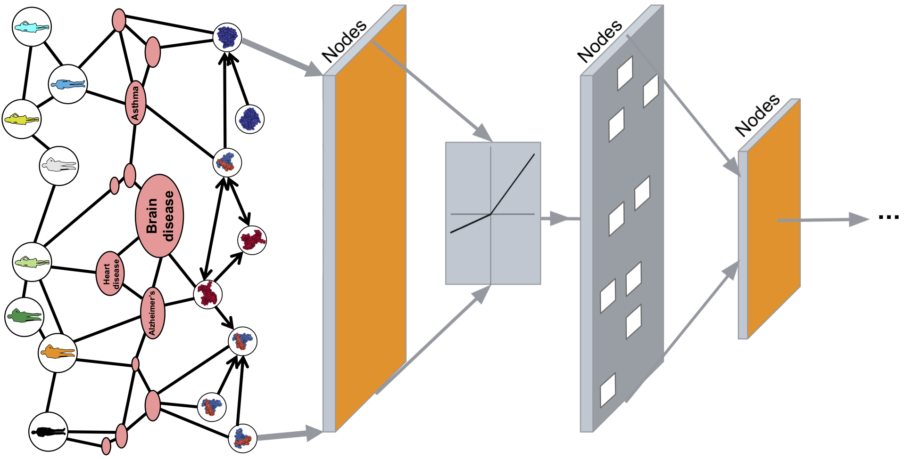

# Tutorials for Machine Learning on Graphs

## Contributors

- Payal Chandak (payal.chandak@columbia.edu)
- Haoxin Li (haoxin_li@hsph.harvard.edu)
- Min Jean Cho (min_jean_cho@brown.edu)
- Pavlin Policar (pavlin.policar@fri.uni-lj.si)
- Mert Erden (mert.erden@tufts.edu)
- Steffan Paul (steffanpaul@g.harvard.edu)
- Marinka Zitnik (marinka@hms.harvard.edu)

## Overview

Graph machine learning provides a powerful toolbox to learn representations from any arbitrary graph structure and use learned representations for a variety of downstream tasks. These tutorials aim to:

1. Introduce the concept of graph neural networks (GNNs).
2. Discuss the theoretical motivation behind different GNN architectures.
3. Provide implementations of these architectures.
4. Apply the architectures to key prediction problems on interconnected data in science and medicine.
5. Provide end-to-end real-world examples of graph machine learning.

## Requirements

Recent versions of NumPy, PyTorch, PyTorch Geometric and Jupyter are required. 

## Installation

All the required packages can be installed using the following commands:

1. `git clone https://github.com/mims-harvard/graphml-tutorials.git`
2. `cd graphml-tutorials`
3. `chmod +x install.sh && ./install.sh`
4. `conda activate graphml_venv`

## Contributing

Pull requests are welcome.

## License

[MIT](https://choosealicense.com/licenses/mit/)
